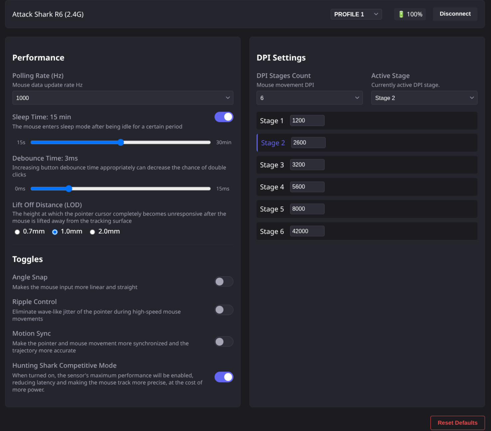

# Attack Shark R6 WebHID Configurator

> **Note:** I've vibecoded the s#1t out of this, so yeah, keep that in mind. Just wanted to be able to configure my mouse on Linux. (check udev prerequisites)



A driverless, cross-platform WebHID configurator for the Attack Shark R6 wireless mouse. This project allows you to fully configure your mouse directly from your browser without needing the official Windows app or the official "webdriver" (which does not work on wireless for whatever reason).

## Features
- **Driverless Web Interface:** No installation required, works directly via Chrome/Edge WebHID.
- **Hardware Multi-Profile Switching:** Query, edit, and switch between the 3 on-board physical memory profiles.
- **Cross-Platform:** Works on Windows, macOS, and Linux.
- **Wired & 2.4G Wireless Support:** Fully handles the strict protocol requirements of the 2.4G dongle.
- **Performance Settings:** Configure Polling Rate, Lift-Off Distance (LOD), Debounce Time, and Sleep Time.
- **DPI Management:** Full read/write access to the 6-stage DPI table, with intelligent stage count clamping and defaults.
- **Toggles:** Toggle Angle Snapping, Ripple Control, Motion Sync, and Competitive Mode.
- **Live Battery:** Real-time battery percentage polling (not really tested so it migh not work and just seems to work).

## Getting Started

### Prerequisites
- Node.js (v16+)
- A WebHID-compatible browser (Google Chrome, Microsoft Edge, Opera, etc.)

### Linux Requirements (udev rules)
On Linux, browsers do not have permission to access HID devices by default. You must add a `udev` rule to grant your user account access to the R6 mouse.

1. Create a new udev rules file:
   ```bash
   sudo nano /etc/udev/rules.d/99-r6-mouse.rules
   ```
2. Add the following lines (Vendor ID `373e`):
   ```udev
   SUBSYSTEM=="usb", ATTR{idVendor}=="373e", MODE="0666"
   KERNEL=="hidraw*", ATTRS{idVendor}=="373e", MODE="0666"
   ```
3. Reload the rules and re-plug your mouse/dongle:
   ```bash
   sudo udevadm control --reload-rules
   sudo udevadm trigger
   ```

### Installation & Running
1. Install the dependencies:
   ```bash
   npm install
   ```
2. Start the Vite development server:
   ```bash
   npm run dev
   ```
3. Open the provided `localhost` URL in your browser.
4. Click **Connect R6 Mouse** and select the "Attack Shark R6" device from the browser popup.

## Project Structure
- `src/main.ts`: Main entry point and UI data binding logic.
- `src/driver/hid-manager.ts`: Core WebHID connection manager and state store.
- `src/driver/transaction-queue.ts`: Handles the complex polling required for read/write handshakes over 2.4G.
- `src/protocol/commands.ts`: The byte-level payload builders mapping to the R6 protocol.
